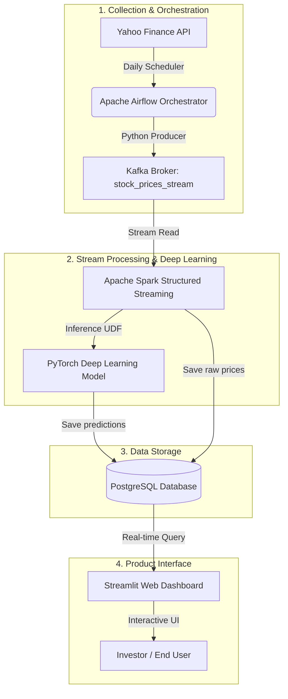

# 📈 FinStream-AI: Real-Time Deep Stock Forecasting & Intelligent Strategy Ecosystem

[](https://www.docker.com/)
[](https://spark.apache.org/)
[](https://kafka.apache.org/)
[](https://airflow.apache.org/)
[](https://pytorch.org/)
[](https://streamlit.io/)
[](https://www.postgresql.org/)

**FinStream-AI** is a real-time Big Data processing system that combines deep learning time-series forecasting with a professional automation orchestrator. The system automatically collects market price data via API, streams it through a fault-tolerant message queue, performs next-day closing price inference via a PyTorch model running on distributed Spark, stores results in a database, and delivers a premium interactive Dark Mode Web UI to support investors in building trading strategies.


## 🎨 System Architecture




## 🔥 Key Features

1. **🔮 Automated AI Signals**: Automatically collects stock price data via Yahoo Finance API and generates smart trading signals — `BUY (Long)` / `CASH (Hold)`.
2. **⚡ Large-Scale Stream Processing**: Integrates Spark Structured Streaming with Kafka Broker; applies Min-Max normalization over a 20-session sliding window before inference.
3. **🎯 High-Accuracy Deep Learning Model**: Uses a deep learning model via PyTorch to forecast the next-day closing price with high accuracy (**average portfolio MAPE < 5%**, **R² > 0.98**).
4. **📊 Interactive Strategy Simulation**: Allows users to select a custom historical time range for backtesting, and automatically compares cumulative returns and Max Drawdown across strategies: *Buy & Hold*, *Long-Only AI*, and *Long-Short AI*.
5. **🐳 Fully Containerized via Docker**: The entire system is containerized end-to-end via Docker Compose for rapid deployment on any environment.


## 🛠️ Tech Stack

| Layer | Technology |
| :--- | :--- |
| **Orchestrator** | Apache Airflow 2.7.2 |
| **Data Ingestion** | Python `yfinance` API |
| **Message Queue** | Apache Kafka & Zookeeper |
| **Big Data Engine** | Apache Spark 3.3.0 |
| **Deep Learning Core** | PyTorch & PySpark UDF |
| **Storage** | PostgreSQL 14 |
| **Visualization UI** | Streamlit 1.57.0 (Dark Mode) |

## 📂 Project Structure

```text
FinStream-AI/
├── docker-compose.yml              # Manages the lifecycle of all service containers
├── README.md                       # Quick-start documentation
├── producer/                       # yfinance data ingestion source code
│   ├── yfinance_producer.py
│   ├── config.example.py           # Config template (copy and rename to config.py)
│   └── config.py                   # Your private config — DO NOT commit to Git
├── airflow/                        # Apache Airflow configuration & scheduling
│   ├── dags/
│   │   └── stock_ingestion_dag.py
│   └── Dockerfile.airflow
├── spark_app/                      # Spark Streaming engine & PyTorch UDF
│   ├── main.py
│   ├── dls_ts_net.py
│   └── dls_ts_net.pt
├── dashboard/                      # Interactive Streamlit Web UI
│   ├── app.py
│   ├── requirements.txt
│   └── Dockerfile.dashboard
└── db_init/                        # SQL scripts for database schema initialization
```

## 🚀 Quick Start

### Prerequisites
* **Docker** and **Docker Compose** installed on your machine.

### Steps

1. **Step 1** — Set up your stock ticker configuration from the template:
   ```bash
   cp producer/config.example.py producer/config.py
   ```
   Then open `producer/config.py` and **replace the ticker list** with the stocks you want to track:
   ```python
   TICKERS = {
       "FPT.VN": "FPT",   # Replace with your desired stock tickers
       "VCB.VN": "VCB",
       # Add more tickers here...
   }
   ```

2. **Step 2** — Start all container services in the background:
   ```bash
   docker-compose up -d
   ```

3. **Step 3** — Verify all services are running (expect 7 healthy containers):
   ```bash
   docker ps
   ```


## 🔌 Default Service Ports

Once the system is up, access the following endpoints:

| Service | URL | Default Credentials | Description |
| :--- | :--- | :---: | :--- |
| **Streamlit Dashboard** | **`http://localhost:8501`** | *Not required* | Dark Mode UI for forecasts and strategy simulation |
| **Apache Airflow** | **`http://localhost:8085`** | `admin` / `admin` | Monitor the daily yfinance ingestion schedule |
| **Spark Master UI** | **`http://localhost:8080`** | *Not required* | Monitor Spark Streaming processing performance |
| **PostgreSQL DB** | `localhost:5432` | `myuser` / `mypassword` | Direct access to the `stock_db` database |


## 📈 Simulation Results & Risk Assessment Summary

* **Outstanding accuracy**: The R² coefficient for leading stocks like **FPT** reaches **0.9925**, demonstrating the AI algorithm's exceptional ability to capture market trends.
* **Downside risk mitigation (Max Drawdown)**: For **SSI**, the traditional Buy & Hold strategy suffered a loss of **-12.96%** (asset drawdown of **-88.33%**). In contrast, the AI **Long-Only** strategy turned that loss into a **6,052.88%** gain while reducing Max Drawdown to just **-46.46%** by staying in cash throughout the downtrend.

> [!WARNING]
> **Disclaimer**: Simulation results are based on historical data and do not guarantee similar performance in the future. Real-world trading is subject to transaction fees, taxes, and slippage. Users are solely responsible for managing their own risk when making investment decisions.
